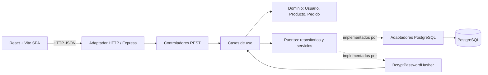
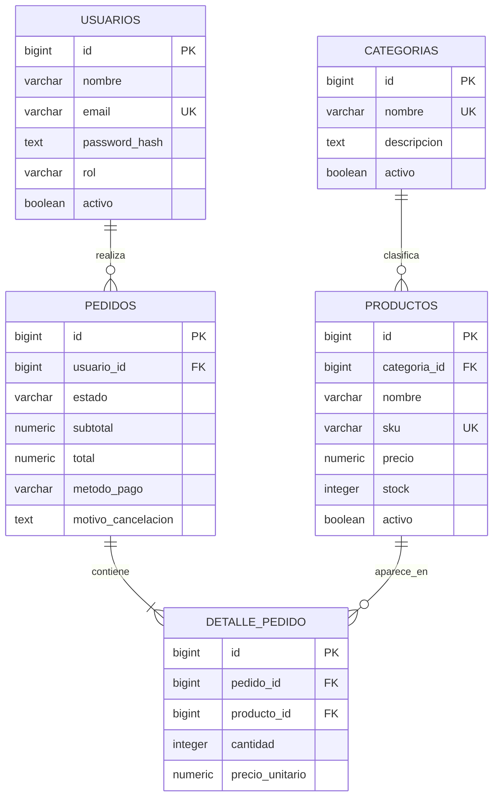

# Arquitectura y modelo de datos

## Arquitectura hexagonal

El dominio contiene reglas de negocio y no depende de Express ni de PostgreSQL. Los casos de uso coordinan operaciones a través de puertos. Los adaptadores HTTP y PostgreSQL implementan los límites externos. El cliente React consume la API mediante servicios separados.

## Modelo relacional

`DETALLE_PEDIDO` es la entidad asociativa que representa la relación muchos a muchos entre pedidos y productos, conserva precio/nombre de compra y permite descontar o restaurar inventario transaccionalmente. Un usuario tiene muchos pedidos; una categoría clasifica muchos productos.